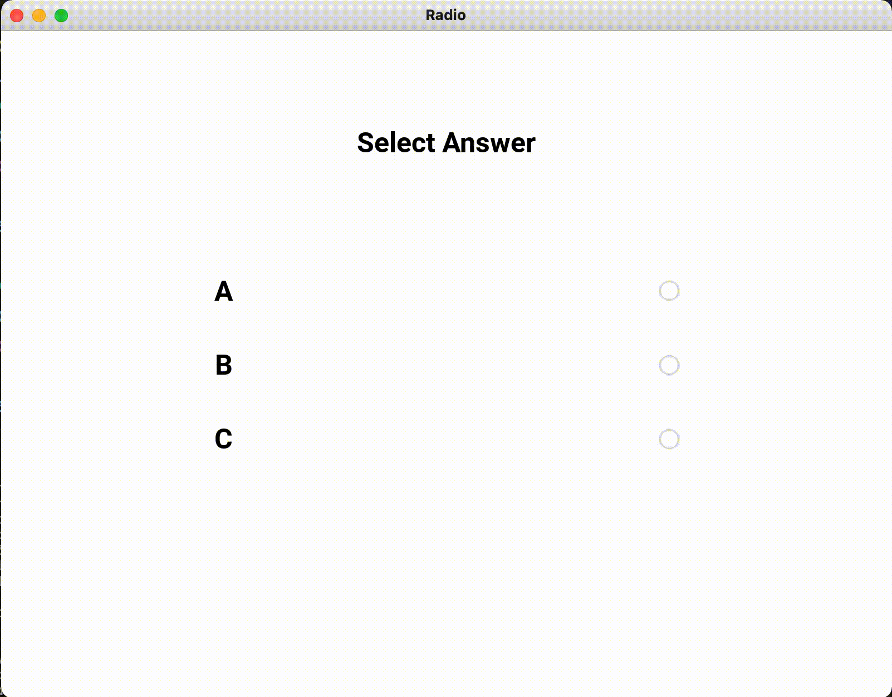

# KivyEx
A repository of Examples with the Kivy framework

## Anaconda environment installation:

Please to run the eamples contained in each folder follow the steps below:

```
conda create -n kivy  python=3.8
```

```
conda activate kivy
```

```
pip install kivy
```

```
pip install kivymd
```

At this point your environment "kivy" should be functional and ready to go!

---

## Gallery of Examples:

<div id="" class="center">
    <table> 
        <tr>
            <td style="padding:10px">
        	    <a href="https://github.com/carmelosammarco/MyKivyGallery/tree/main/Examples/1-basic"></a>
      	    </td>
            <td style="padding:10px">
            	<a href="https://github.com/carmelosammarco/MyKivyGallery/tree/main/Examples/2-BoxLayout"></a>
            </td>
            <td style="padding:10px">
            	<a href="https://github.com/carmelosammarco/MyKivyGallery/tree/main/Examples/3-FloatLayout"></a>
            </td>
            <td style="padding:10px">
            	<a href="https://github.com/carmelosammarco/MyKivyGallery/tree/main/Examples/4-Backgroundcolor"></a>
            </td>
        </tr>
        <tr>
            <td style="padding:10px">
        	    <a href="https://github.com/carmelosammarco/MyKivyGallery/tree/main/Examples/5-WidgetProperty"></a>
      	    </td>
            <td style="padding:10px">
            	<a href="https://github.com/carmelosammarco/MyKivyGallery/tree/main/Examples/6-Images"></a>
            </td>
            <td style="padding:10px">
            	<a href="https://github.com/carmelosammarco/MyKivyGallery/tree/main/Examples/7-Tabs"></a>
            </td>
            <td style="padding:10px">
            	<a href="https://github.com/carmelosammarco/MyKivyGallery/tree/main/Examples/8-buttonimg"></a>
            </td>
        </tr>
	    <tr>
    	    <td style="padding:10px">
        	    <a href="https://github.com/carmelosammarco/MyKivyGallery/tree/main/Examples/9-Accordion"></a>
      	    </td>
            <td style="padding:10px">
            	<a href="https://github.com/carmelosammarco/MyKivyGallery/tree/main/Examples/10-carousel"></a>
            </td>
            <td style="padding:10px">
            	<a href="https://github.com/carmelosammarco/MyKivyGallery/tree/main/Examples/11-Labelcolors"></a>
            </td>
            <td style="padding:10px">
            	<a href="https://github.com/carmelosammarco/MyKivyGallery/tree/main/Examples/12-Updatelabel"></a>
            </td>
        </tr> 
        <tr>
            <td style="padding:10px">
        	    <a href="https://github.com/carmelosammarco/MyKivyGallery/tree/main/Examples/13-roundedbutton"></a>
      	    </td>
            <td style="padding:10px">
            	<a href="https://github.com/carmelosammarco/MyKivyGallery/tree/main/Examples/14-checkbox"></a>
            </td>
            <td style="padding:10px">
            	<a href="https://github.com/carmelosammarco/MyKivyGallery/tree/main/Examples/15-radiobutton"></a>
            </td>
            <td style="padding:10px">
            	<a href="https://github.com/carmelosammarco/MyKivyGallery/tree/main/Examples/16-dropdown"></a>
            </td>
        </tr>
	    <tr>
    	    <td style="padding:10px">
        	    <a href="https://github.com/carmelosammarco/MyKivyGallery/tree/main/Examples/17-Sliders"></a>
      	    </td>
            <td style="padding:10px">
            	<a href="https://github.com/carmelosammarco/MyKivyGallery/tree/main/Examples/18-inputboxes"></a>
            </td>
            <td style="padding:10px">
            	<a href="https://github.com/carmelosammarco/MyKivyGallery/tree/main/Examples/19-outputTerminal"></a>
            </td>
            <td style="padding:10px">
            	<a href="https://github.com/carmelosammarco/MyKivyGallery/tree/main/Examples/20-progressbar"></a>
            </td>
        </tr> 
        <tr>
            <td style="padding:10px">
        	    <a href="https://github.com/carmelosammarco/MyKivyGallery/tree/main/Examples/21-popup"></a>
      	    </td>
            <td style="padding:10px">
            	<a href="https://github.com/carmelosammarco/MyKivyGallery/tree/main/Examples/22-animation"></a>
            </td>
            <td style="padding:10px">
            	<a href="https://github.com/carmelosammarco/MyKivyGallery/tree/main/Examples/23-Dragbox"></a>
            </td>
            <td style="padding:10px">
            	<a href="https://github.com/carmelosammarco/MyKivyGallery/tree/main/Examples/24-calculator"></a>
            </td>
        </tr>
	    <tr>
    	    <td style="padding:10px">
        	    <a href="https://github.com/carmelosammarco/MyKivyGallery/tree/main/Examples/25-MyPaint"></a>
      	    </td>
            <td style="padding:10px">
            	<a href="https://github.com/carmelosammarco/MyKivyGallery/tree/main/Examples/26-PingPOng"></a>
            </td>
            <td style="padding:10px">
            	<a href="https://github.com/carmelosammarco/MyKivyGallery/tree/main/Examples/27-loginform"></a>
            </td>
            <td style="padding:10px">
            	<a href="https://github.com/carmelosammarco/MyKivyGallery/tree/main/Examples/28-TodoAppKivyMD"></a>
            </td>
        </tr> 
    </table>
</div>

---

### **Many thanks to visit this page**