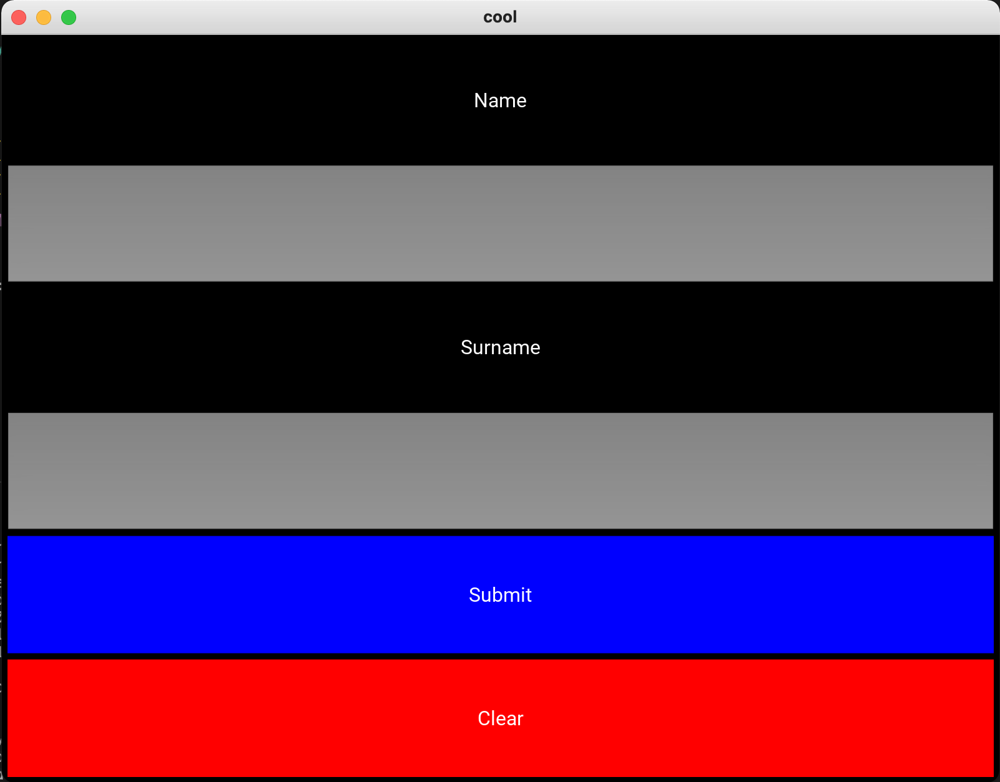
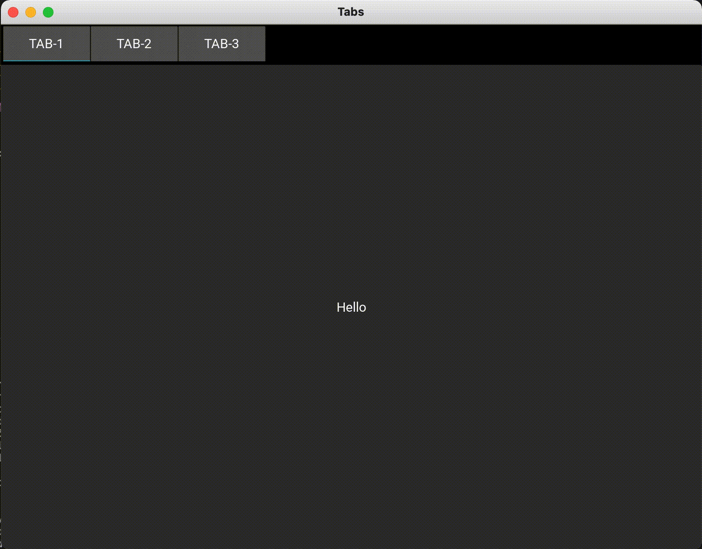

# KivyEx
A repository of Examples with the Kivy framework

## Anaconda environment installation:

Please to run the eamples contained in each folder follow the steps below:

```
conda create -n kivy  python=3.8
```

```
conda activate kivy
```

```
pip install kivy
```

At this point your environment "kivy" should be functional and ready to go!

---

## Gallery of Examples:

<div id="">
    <table>
        <tr>
            <td style="padding:10px">
        	    <a href="https://github.com/carmelosammarco/MyKivyGallery/tree/main/Examples/1-basic"></a>
      	    </td>
            <td style="padding:10px">
            	<a href=""></a>
            </td>
            <td style="padding:10px">
            	<a href=""></a>
            </td>
            <td style="padding:10px">
            	<a href=""></a>
            </td>
        </tr>
        <tr>
            <td style="padding:10px">
        	    <a href=""></a>
      	    </td>
            <td style="padding:10px">
            	<a href=""></a>
            </td>
            <td style="padding:10px">
            	<a href=""></a>
            </td>
            <td style="padding:10px">
            	<a href=""></a>
            </td>
        </tr>
	    <tr>
    	    <td style="padding:10px">
        	    <a href=""></a>
      	    </td>
            <td style="padding:10px">
            	<a href=""></a>
            </td>
            <td style="padding:10px">
            	<a href=""></a>
            </td>
            <td style="padding:10px">
            	<a href=""></a>
            </td>
        </tr> 
        <tr>
            <td style="padding:10px">
        	    <a href=""></a>
      	    </td>
            <td style="padding:10px">
            	<a href=""></a>
            </td>
            <td style="padding:10px">
            	<a href=""></a>
            </td>
            <td style="padding:10px">
            	<a href=""></a>
            </td>
        </tr>
	    <tr>
    	    <td style="padding:10px">
        	    <a href=""></a>
      	    </td>
            <td style="padding:10px">
            	<a href=""></a>
            </td>
            <td style="padding:10px">
            	<a href=""></a>
            </td>
            <td style="padding:10px">
            	<a href=""></a>
            </td>
        </tr> 
        <tr>
            <td style="padding:10px">
        	    <a href=""></a>
      	    </td>
            <td style="padding:10px">
            	<a href=""></a>
            </td>
            <td style="padding:10px">
            	<a href=""></a>
            </td>
            <td style="padding:10px">
            	<a href=""></a>
            </td>
        </tr>
	    <tr>
    	    <td style="padding:10px">
        	    <a href=""></a>
      	    </td>
            <td style="padding:10px">
            	<a href=""></a>
            </td>
            <td style="padding:10px">
            	<a href=""></a>
            </td>
            <td style="padding:10px">
            	<a href=""></a>
            </td>
        </tr> 
    </table>
</div>

---

### **Many thanks to visit this page**